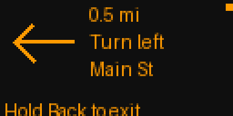

# Flipper Next Turn

**Your next turn, on your Flipper.** Live Google Maps maneuvers — road name, turn arrow, and distance — on the pocket display.

**Bluetooth · Navigation** &nbsp; | &nbsp; **Release v0.9** &nbsp; | &nbsp; **Flipper Zero + Android 8.0+**

### Download & install

**[⬇ Download the Android app](https://github.com/villenull/flipper-next-turn/releases/download/v0.9/flipper-now-debug.apk)** — one **Flipper Now** helper for both Now Playing and Now Turning. Open this link on your phone, download, and tap to install (it upgrades the old Now Playing helper in place).

**[⬇ Download the Flipper app (.fap)](https://github.com/villenull/flipper-next-turn/releases/download/v0.2/nav_turns-fw1.4.3-api87.1.fap)** · [All release files](https://github.com/villenull/flipper-next-turn/releases/tag/v0.9) · [Checksums](https://github.com/villenull/flipper-next-turn/releases/download/v0.4/SHA256SUMS)

> **Preview release.** Built for official Flipper firmware **1.4.3 / API 87.1**. The live Maps drive test has not run yet.

## Screen preview



Simulated layout preview following the production renderer geometry. The actual 128×64 display is coarser; see the [native 128×64 example](docs/media/nav-next-turn-native.png).

## What does Flipper Next Turn do?

Flipper Next Turn turns your Flipper Zero into a handlebar-style navigator. A companion Android helper reads the Google Maps navigation notification and sends each maneuver over a dedicated Bluetooth connection.

- **Turn arrow** for 14 maneuver types: left/right, slight/sharp, U-turn, roundabout, exit, merge, keep, ferry, arrival.
- **Road name and instruction** beside the arrow, scrolling when long.
- **Big live distance** counting down to the maneuver.
- **Rerouting and arrival states** straight from Maps.

Google Maps and the official Flipper Android app stay unchanged. This is a separate APK and external FAP; it does not require a firmware fork.

## How to use

1. **Install the Android app.** Download the APK above on your phone and tap it. If Android prompts, allow installation from your browser.
2. **Enable everything (one tap).** Tap **1 · ENABLE EVERYTHING**, approve the Bluetooth prompts, and enable notification access for **Flipper Now** in the system screen it opens. Sideloaded apps may need the system App info → `⋮` → **Allow restricted settings** first, or Android blocks the toggle.
3. **Copy the Flipper app.** With Nav Turns closed, use qFlipper to copy the FAP to `SD Card/apps/Bluetooth/nav_turns.fap`. No firmware flashing is involved.
4. **Open Now Turning on the Flipper.** Go to **Apps → Bluetooth → Now Turning** (one companion at a time — exit Now Playing first). Disconnect any active management connection in the official Flipper Android app.
5. **Pair (one tap).** Tap **PAIR FLIPPER** — the helper scans for both companion signals, recognizes which app is open on the Flipper, saves it and starts. Confirm the pairing code on both screens. Open only one companion app on the Flipper at a time. Confirm the matching pairing code on both devices (the phone popup sometimes hides in the notification shade — pull it down).
6. **Navigate.** Start driving directions in Google Maps. Each maneuver appears once the connection is ready.

The helper's ongoing notification includes **Stop**. After a reboot or force-stop, open the helper and press Start again.

## Controls

| Flipper button | Action |
|---|---|
| OK | Re-request the current maneuver |
| Hold Back | Exit and restore the default Bluetooth profile |

Only the current maneuver is available from the Maps feed, so there is no next-turn paging; Up/Down/Left/Right are reserved.

## Privacy & requirements

- Android **8.0 / API 26 or newer**; Bluetooth and user-enabled notification access.
- Flipper Zero with an SD card and **official firmware 1.4.3 / API 87.1**.
- No Internet permission, backend, account, root, analytics, or location-history database. Only Google Maps navigation notifications are read.
- The app uses its own Bluetooth identity (`NV…` advert) and bond storage.

## Validation status

The local build passes **14 NAV/1 golden vectors**, **9 parser cases**, **C ASan/UBSan** (vectors, splits, every-bit corruption, model, input, scroll), Kotlin unit tests, and Android lint with no errors. The FAP imports only officially exported API symbols.

**Still awaiting physical acceptance:** live Maps drive test, pairing, reconnection, and endurance. Protocol details: `protocol/nav_constants.json`.

## Changelog

### v0.9

- Lowercase `now` wordmark launcher icon.

### v0.8

- Minimal centered layout with permission dot and one-line companion rows.

### v0.7

- Single PAIR FLIPPER button: scans both signals, auto-classifies by service UUID.

### v0.6

- Minimal UI: centered title, one enable button, one button per companion, gear-icon settings.

### v0.5

- Dark Flipper-app-inspired UI: cards, orange actions, per-companion status dots.

### v0.4

- Status screen no longer overwrites scan messages with stale STOPPED.

### v0.3

- One-tap setup: ENABLE EVERYTHING plus per-companion PAIR buttons with strongest-match auto-pick.
- New eñe launcher icon.

### v0.2

- Unified **Flipper Now** helper: Now Playing and Now Turning in one APK (upgrades the old helper in place).
- Navigation renamed to **Now Turning** (display only; advert `NT…`, same wire protocol and identity).
- Device entries show 8 address characters so the two companions are distinguishable.

### v0.1

- Initial preview: NAV/1 wire protocol, Flipper renderer with 14 turn arrows, Maps notification scraper, dedicated BLE service with numeric-comparison pairing.
- Short advert name and startup advertising self-check, carried over from the Now Playing radio fix.
- Right-turn paging intentionally omitted: the feed exposes one maneuver at a time.

## Build from source

```sh
./scripts/bootstrap.py --accept-android-sdk-license
source scripts/env.sh && cd android && ./gradlew :navcore:test :navapp:assembleDebug
(cd .cache/flipper-firmware && ./fbt fap_nav_turns)
```

Read the Android SDK license before supplying its acceptance flag. Toolchains are pinned in [`.toolchains.lock.json`](.toolchains.lock.json). Builds never flash firmware or install onto a device.

## Credits & references

- [Official Flipper firmware](https://github.com/flipperdevices/flipperzero-firmware): exported API, BLE infrastructure, Canvas and native fonts.
- [Android notification-listener APIs](https://developer.android.com/reference/android/service/notification/NotificationListenerService): navigation notification access.
- Sibling project [flipper-now-playing](https://github.com/villenull/flipper-now-playing): architecture, radio lessons, and this listing's organization.

The catalog icon and orange preview are generated by [`docs/media/render_nav.py`](docs/media/render_nav.py) following the production renderer geometry; they are simulated previews, not device captures.

[GPL-3.0 license](LICENSE) · [Third-party notices](THIRD_PARTY_NOTICES.md) · [Report an issue](https://github.com/villenull/flipper-next-turn/issues)
